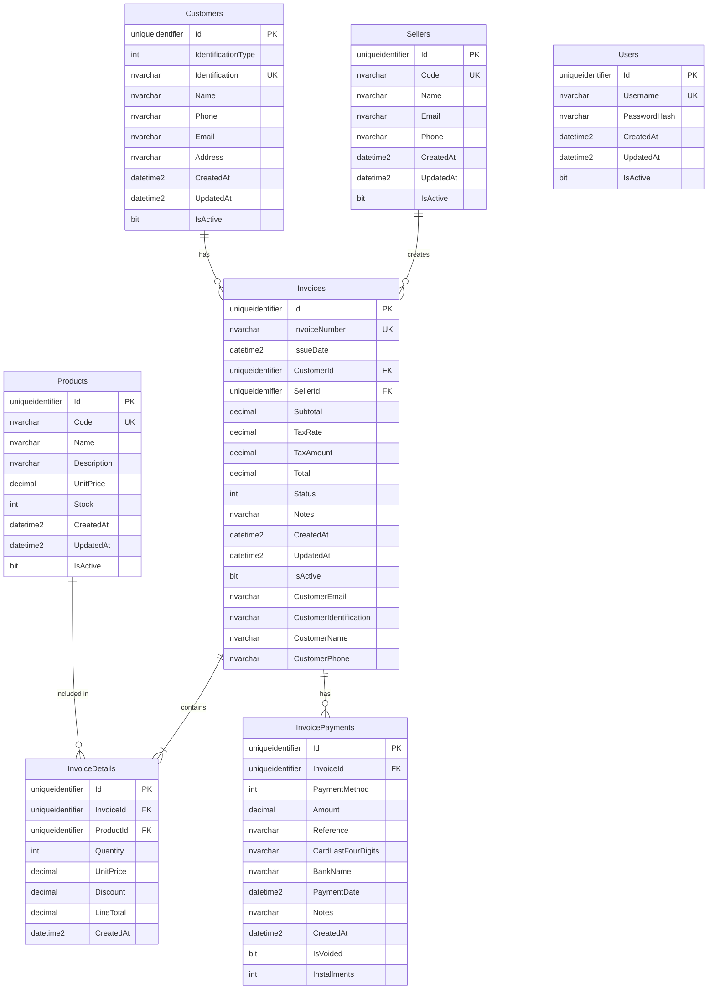

# Invoice Management System

Sistema de gestión de facturas completo (Full Stack) desarrollado como parte de la evaluación técnica.

## 📋 Descripción
Esta solución implementa un sistema para la gestión de facturas, clientes, vendedores y productos. Permite la creación, consulta y administración de documentos de facturación, siguiendo una arquitectura moderna y escalable.

## 🌐 Despliegue en Vivo (Live Demo)
El proyecto se encuentra desplegado y funcional en Microsoft Azure:
- **Frontend (App Web)**: [Ver Aplicación](https://purple-tree-0d5bcc61e.1.azurestaticapps.net)
- **Backend (Swagger UI)**: [Ver Documentación API](https://api-jguillen-aza3g7cxh8d2e4c5.centralus-01.azurewebsites.net/swagger/index.html)

## 🚀 Tecnologías y Arquitectura

### Backend
- **Tecnología**: .NET 9 Web API
- **Arquitectura**: Clean Architecture (Capas: API, Application, Domain, Infrastructure)
- **Base de Datos**: SQL Server (Entity Framework Core Code-First)
- **Características**:
  - API RESTful
  - Inyección de dependencias
  - Repositorio Genérico y Unit of Work
  - DTOs y Mappers

### Frontend
- **Tecnología**: Angular 18 a
- **Estilos**: PrimeNG + PrimeFlex
- **Características**:
  - Componentes Standalone
  - Servicios tipados
  - Gestión de estado reactivo
  - Diseño responsivo

## 🛠️ Instrucciones de Instalación y Ejecución

### Prerrequisitos
- .NET SDK 9.0 o superior
- Node.js (LTS recomendado)
- SQL Server (LocalDB o instancia completa)

### Pasos para levantar el Backend
1. Navegar a la carpeta del backend:
   ```bash
   cd backend
   ```
2. Restaurar dependencias:
   ```bash
   dotnet restore
   ```
3. Ejecutar la aplicación (la base de datos se creará automáticamente si está configurada la conexión):
   ```bash
   dotnet run --project src/InvoiceSystem.API
   ```
   *La API estará disponible en `https://localhost:7145` (o el puerto configurado).*

### Pasos para levantar el Frontend
1. Navegar a la carpeta del frontend:
   ```bash
   cd frontend/invoice-app
   ```
2. Instalar dependencias:
   ```bash
   npm install
   ```
3. Iniciar el servidor de desarrollo:
   ```bash
   ng serve
   ```
4. Acceder a la aplicación en el navegador: `http://localhost:4200`

## 📊 Modelo de Datos (Diagrama Entidad-Relación)



## ✅ Funcionalidades Implementadas
- **Gestión de Entidades**: Gestión completa (CRUD) de Clientes, Vendedores y Productos.
- **Facturación**: Creación de facturas con múltiples líneas de detalle.
- **Búsqueda**: Filtros avanzados por fecha, cliente o número de factura.
- **Validaciones**: Reglas de negocio en el backend y validaciones reactivas en el frontend.
